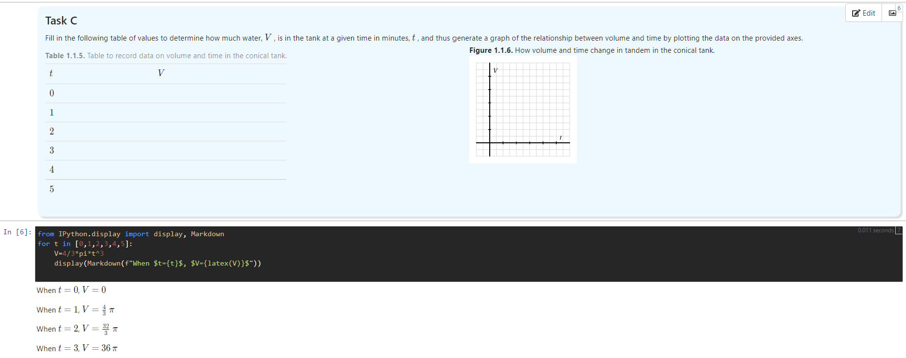

# active-calculus-jupyter

Jupyter notebooks for [ActiveCalculus.org](https://activecalculus.org) activities.

[](https://share.cocalc.com/share/d175250ef74d96b440e7753e3235543865700ab6/active-calculus-jupyter/)

## Installation

You'll need a copy of Active Prelude to Calculus in the folder `apc`:

```
git clone https://github.com/active-calculus/prep.git apc
```

To install python libraries (one-time process):
*(replace `python` with `python3` if necessary)*

```
python -m pip install pipenv
pipenv install
```

To build the notebooks (within the pipenv shell):

```
pipenv shell
python build.py
```
